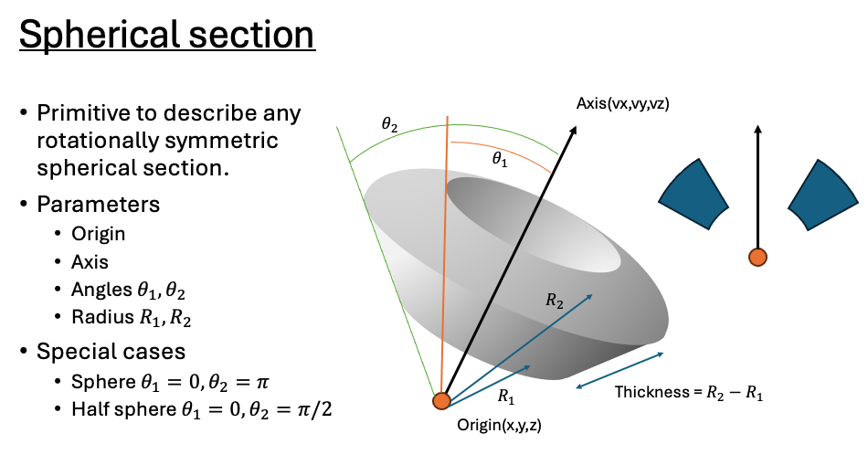
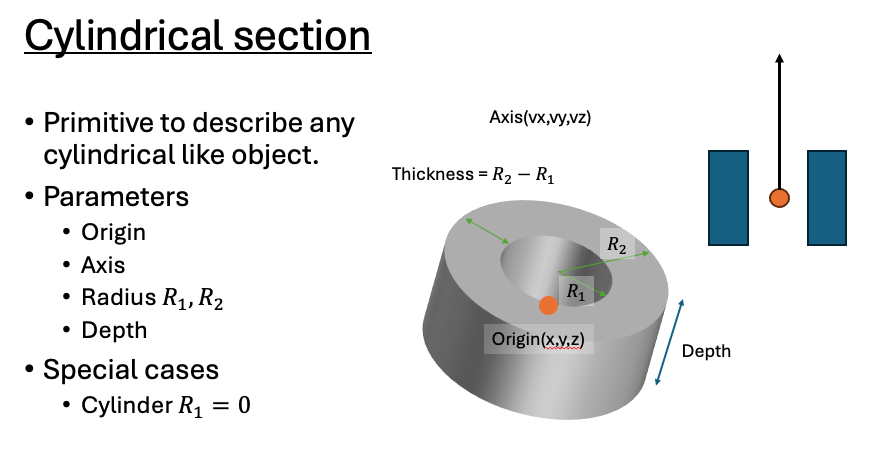
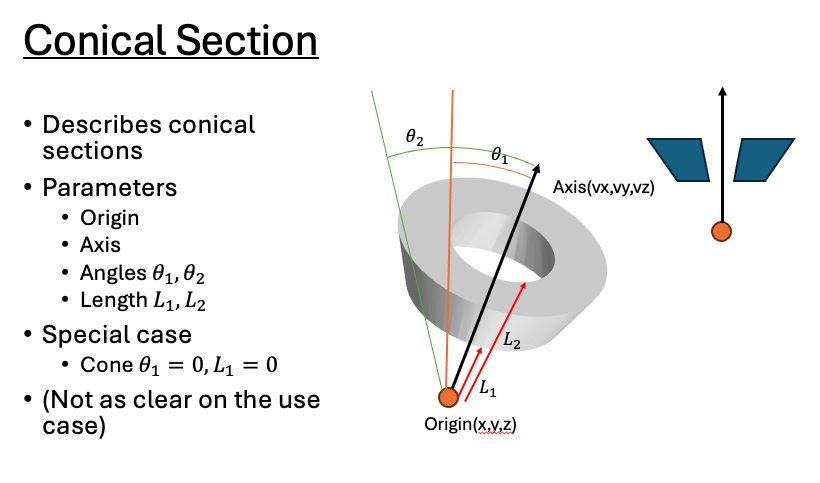

# RTK GEANT4


## External Dependencies

- [ ] [GEANT4 Installation](https://geant4.web.cern.ch/download) (Instructions for build below)
- [ ] [TENDL Dataset](https://cern.ch/geant4-data/datasets/G4TENDL.1.4.tar.gz)
- [ ] [LEND Dataset](ftp://gdo-nuclear.ucllnl.org)


## Define variables

export G4PARTICLEHPDATA=/path/to/geant4-install/share/Geant4/data/G4TENDL1.4

export G4LENDDATA=/path/to/LEND_GND1.3/LEND_GND1.3_ENDF.BVII.1

## Building GEANT4

Reference: https://geant4-userdoc.web.cern.ch/UsersGuides/InstallationGuide/html/index.html
1) Source Preparation

    Get the source code https://geant4.web.cern.ch/download
    Unzip it and you should get a folder named "geant4-"+version (v11.1.2 as of this writing) and prepare the following file tree by making an empty build directory:

├── geant4-src\
│   ├── geant4-v11.1.2\
│   ├── geant4-v11.1.2-build\\

2) Build Procedures

(Choice A) To use QT, inside the build directory, perform:

```
$cmake -DCMAKE_INSTALL_PREFIX=path/to/destination/geant4-v11.1.2-install -DGEANT4_INSTALL_DATA=ON -DGEANT4_USE_QT=ON -DGEANT4_USE_QT3D=ON /path/to/geant4-src/geant4-v11.1.2 
```
(Choice B) To use X11, you can do:

```
$cmake -DCMAKE_INSTALL_PREFIX=path/to/destination/geant4-v11.1.2-install -DGEANT4_INSTALL_DATA=ON -DGEANT4_USE_OPENGL_X11=ON /path/to/geant4-src/geant4-v11.1.2
```
After that, you can start building by (N is the number of cores you want to allocate):
```
$make -jN
$make install
```

3) Post-install

The Geant4PackageCache.cmake is known to be buggy during the build process. Since it is a cache file, you should safely remove it.
```
$rm path/to/destination/geant4-v11.1.2-install/lib/Geant4-11.1.2/Geant4PackageCache.cmake
```
You may want to use the geant.sh provide to set your environment variables:
```
$source path/to/destination/geant4-v11.1.2-install/bin/geant4.sh
```
4) Optional Testing

To test the installation, you can try out one of the provided example:
```
$ cd path/to/destination/geant4-v11.1.2-install/share/Geant4-11.1.2/examples/basic/B1
$ mkdir build && cd build
$ cmake ..
$ make -jN
$ ./exampleB1
```
5) Platform-specific tips (Feel free to add)
MacOS

For mac users, I recommend usesing QT instead of X11. Make sure you have qt5 installed. The repository for qt5 in brew is qt@5:
```
brew install qt@5
```
Make sure you have the latest xcode and command line tools installed:
```
xcode-select --install
```
If you have command line tools recently updated, you may need to agree to the latest license:
```
sudo xcodebuild -license
```

## Supported Geometries

The following geometry sections are supported in RadSim, and can be used as illustrated below to construct more complicated composite geometries.



