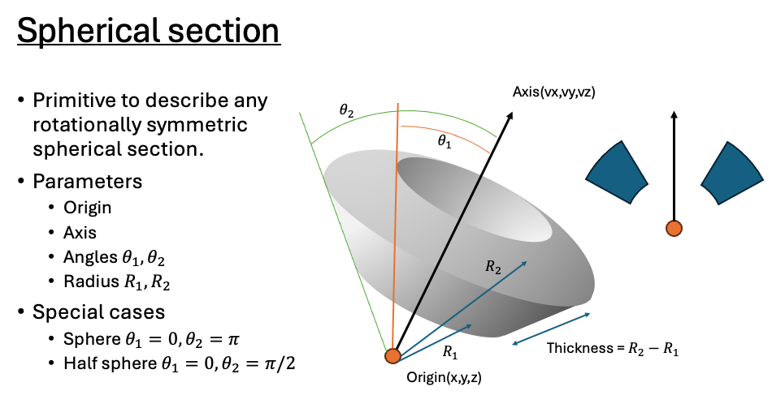
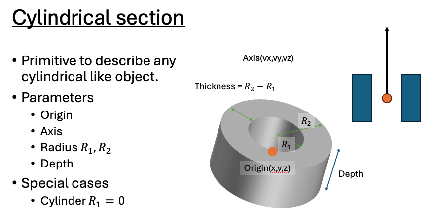
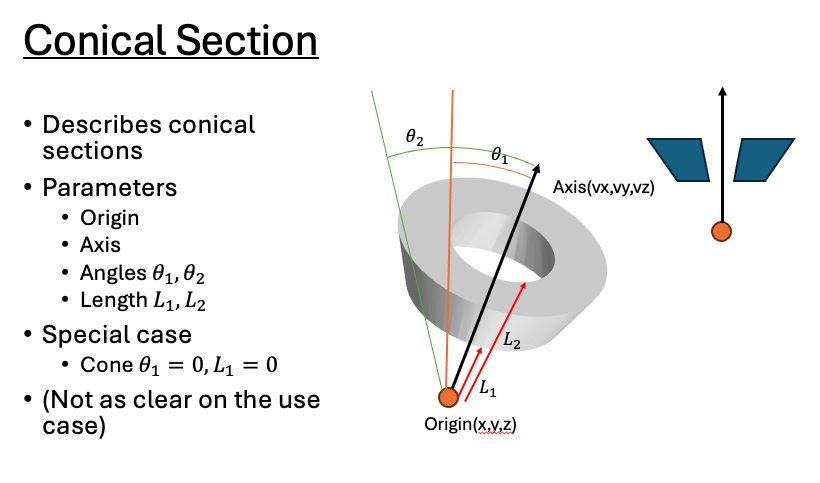

# RTK MCNP API

This is an API to build and run MCNP decks in a Java environment. 
Building MCNP decks with this API still requires basic familiarity of MCNP. 
The manuals for MCNP are located [here](https://mcnp.lanl.gov/manual.html).
This framework removes some of the problematic idiosyncrasies of MCNP such as strict ordering of declarations and
strict arbitrary whitespace requirements while also allowing the user to declare variable parameters that can be 
changed across multiple simulations. 

For RadSim, this API will be used "underneath" another allowing users to specify detector geometries and sources 
to be simulated in MCNP without any prior knowledge of MCNP. A python notebook illustrating the use of this tool can be found in the py directory.

## Use

The API works by declaring a `Job` to be simulated which contains a `Deck` describing the problem that must be built 
beforehand. The `Deck` is essentially a container of various Lists of Objects required to describe the problem. The includes:
* Cells
* Particles
* Tallys

### Cells

Cells are the building blocks of the MCNP geometry. All physical space must be defined by some cell. In MCNP, this includes
a cell that represents the "outside world" or everything outside the system of interest. In this API this cell is generated 
automatically and does not need to be included in decks.

Cells are defined by:
* A volume: Volumes are initiated with an axis and an orientation relative to that axis. 
* A material with some density: Materials are a collection of isotopes with associated number or weight fractions. 

## Particles

Particles are simply what particles are to be considered in the MCNP simulation. They are not restricted to the source particles
although, the source particle should be included in the simulation.

However, it requires knowing the MCNP `id` for the particle you want. This is alleviated by child classes like 
`Photon` and `Electron` that carry that information internally. Particles also have various physics options that can be
set by providing a list of Objects in the order expected by the MCNP physics card. All these options have been given 
explicit variables in the child classes to increase transparency. 

## Tallys

Tallys represent the information to be recorded by the simulation. Tallys can have the following types:
* SURFACE_CURRENT
* SURFACE_FLUX
* CELL_FLUX
* POINT_FLUX
* PINHOLE_FLUX_IMAGE
* PLANAR_RADIOGRAPH_FLUX_IMAGE
* CYLINDRICAL_RADIOGRAPH_FLUX_IMAGE
* CELL_ENERGY_DEPOSITION
* COLLISION_HEATING
* CELL_FISSION_ENERGY
* PULSES
* CHARGE_DEPOSITION

Each representing a different type of integration to be performed by MCNP. Tallys require:
* A particle to integrate
* A list of locations to perform the integration(s)
* An integration type

The most common tallys are done on surfaces and cells and these are the tallys currently supported by the API. 

## Supported Geometries

The following geometry sections are supported in RadSim, and can be used as illustrated below to construct more complicated composite geometries.

